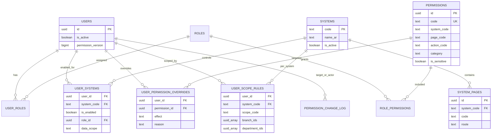

# مخطط قاعدة بيانات الصلاحيات

الجداول القديمة `core.user_roles`, `core.user_branches`, و`core.user_departments` محفوظة وتستمر في دعم الهوية والتنظيم، بينما القواعد الجديدة تضيف التفعيل والنطاق والاستثناءات لكل نظام.
